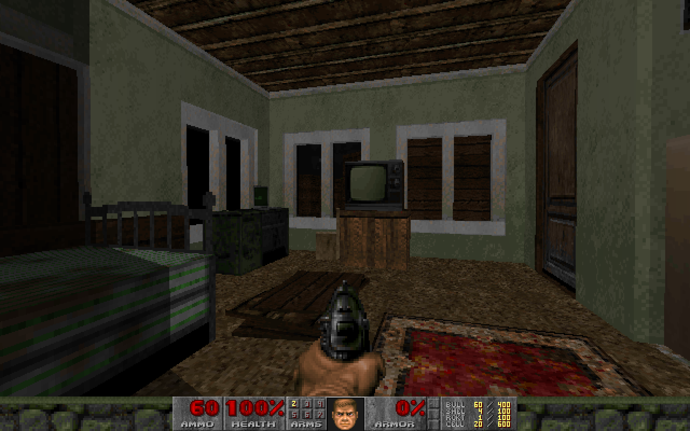

# VtM Bloodlines - Santa Monica in Doom

I had a hankering to run around Santa Monica in Doom, but I got carried away 
decorating the haven instead

  

## Current status

Very much a work in progress

I would like to be able to at least run around outside Santa Monica

This alone is a huge amount of work, let alone the interiors

Some ideas though:

### Mecurio Quest

Locations needed:

- Haven
- Main Street
- Santa Monica Suites
- Carpark
- Beach
- Beach House

1. Go to Mercurio location to get the blue key
2. Blue key unlocks Beach House
3. Fight though beach house to get another key
4. Key unlocks ??? 
5. ???
6. win level

### Bloodhunt

Locations needed:

- Haven
- All streets
- Carpark

Fight through the blood hunt - lots of opportunities to mess around with enemy
sprites, custom weapons (disciplines?)

Use "walk over this sidedef to end level" (this exists?) around taxi 

### BFG La Croix

Ridiculous storyline where Doomguy finds out about La Croix from Mercurio and 
instead of doing quests etc just finds a teleport to Venture Towers and BFGs
La Croix, winning the game

### General

- Can I make the radio a switch that plays some deb of night?
- Can I make the TV a switch that toggles off/still of news guy? 
  or even a couple of animation frames of news guy?
- How hard is it to add a series of stills as an intro? 
  1. Doomguy drinking in bar
  2. Doomguy sitting on bed (from vtmb intro)
  3. Doomguy on theatre stage next to sire
  4. Start!  
- Can you hack in NPCs and have them tell you quest stuff? 
  Just basic like go here do this, no dialog, too hard.
  Check doomworld for prior art

## What is included

- New levels : 1
- Sounds : No
- Music : No
- Graphics : Yes
- Dehacked/BEX Patch : No
- Demos : No

## Play Information

- Game : DOOM2
- Map # : Map01
- Single Player : Designed for
- Cooperative 2-4 Player : No
- Deathmatch 2-4 Player : No
- Other game styles : No
- Difficulty Settings : Not implemented

## Construction

- Base : New from scratch 
- Build Time : 12 hours (so far)
- May Not Run With : Scissors (yes I know this is a very old joke)
- Tested With : GZDoom, Chocolate, vanilla (with issues)

## Editors used

- Doom Builder X
- Slade 
- Bloodlines SDK
- Photoshop 

## Issues

Scaling is wrong - a mix of poor decisions and Doomguy being really short

Textures need work - the sizes of many assets needs to be tweaked to avoid
alignment issues in vanilla - tested for too long in gzdoom without checking 
against vanilla :/ - also they should be broken up into end pieces, middle 
pieces, patches etc, just brute forcing it at the moment which makes 
editing existing stuff and building new stuff fragile

Lighting needs work 

## License

MIT License

Copyright (c) 2022 Nik Coughlin

Permission is hereby granted, free of charge, to any person obtaining a copy
of this software and associated documentation files (the "Software"), to deal
in the Software without restriction, including without limitation the rights
to use, copy, modify, merge, publish, distribute, sublicense, and/or sell
copies of the Software, and to permit persons to whom the Software is
furnished to do so, subject to the following conditions:

The above copyright notice and this permission notice shall be included in all
copies or substantial portions of the Software.

THE SOFTWARE IS PROVIDED "AS IS", WITHOUT WARRANTY OF ANY KIND, EXPRESS OR
IMPLIED, INCLUDING BUT NOT LIMITED TO THE WARRANTIES OF MERCHANTABILITY,
FITNESS FOR A PARTICULAR PURPOSE AND NONINFRINGEMENT. IN NO EVENT SHALL THE
AUTHORS OR COPYRIGHT HOLDERS BE LIABLE FOR ANY CLAIM, DAMAGES OR OTHER
LIABILITY, WHETHER IN AN ACTION OF CONTRACT, TORT OR OTHERWISE, ARISING FROM,
OUT OF OR IN CONNECTION WITH THE SOFTWARE OR THE USE OR OTHER DEALINGS IN THE
SOFTWARE.
